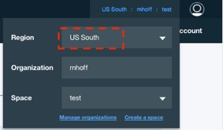
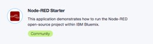
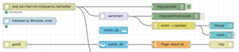

# Node-RED Workshop Hands-Out

 _Program the Bluemix Innovation Platform without writing code!_

_Try some Watson / Bluemix Services_

## Prerequisites:         

Bluemix Account, Browser (not Internet Explorer) 

Link to Bluemix console:   [console.ng.bluemix.net](https://console.ng.bluemix.net)

**We will use Bluemix US for this workshop!**

Make sure that:



## Login to Bluemix & Create Node-RED  runetime

Go to catalog and create the "Node-RED starter" application ( Boilerplates Section )


 
you must give it a **unique name** ( this name is your hostname and so needs to be unique across Bluemix.)

( I use:  [**red-mh** - _mybluemix.net_](https://red-mh.mybluemix.net) )


## Basic Flow with twitter &  Bluemix / Cloudant database

URL for non twitter users:  ```ws://red-mh.mybluemix.net/twitter```



/getdb  template code (mustache) :scissors: :

```mustache
{{#payload}}
<li>{{payload}}</li>
{{/payload}}    
```
( Option if time: install dashboard via "manage palette"  -  add  and configure dashboard nodes  )


##Watson Tone-Analyzer


template code (mustache)  :scissors: :

```mustache
{{#response.document_tone.tone_categories}}
{{category_name}}
------------------
{{#tones}}
{{tone_name}}       {{score}}
{{/tones}}

{{/response.document_tone.tone_categories}}
```


##Watson Visual Recogintion##

Insert Flow code  :scissors: :

```json
[{"id":"a5f31d47.f2359","type":"http in","z":"8b214a3f.2dfac8","name":"","url":"/reco","method":"get","swaggerDoc":"","x":100,"y":440,"wires":[["bdb45433.38ed88"]]},{"id":"bdb45433.38ed88","type":"switch","z":"8b214a3f.2dfac8","name":"Check imageurl param","property":"payload.imageurl","propertyType":"msg","rules":[{"t":"null"},{"t":"else"}],"checkall":"false","outputs":2,"x":280,"y":440,"wires":[["a2b20031.9e3ab"],["44676e37.a2a16"]]},{"id":"a2b20031.9e3ab","type":"template","z":"8b214a3f.2dfac8","name":"Page: get imageurl","field":"payload","fieldType":"msg","format":"html","syntax":"mustache","template":"<h1>Node-RED Watson Visual Recognition</h1>\nEnter a image URL:\n<form  action=\"{{req._parsedUrl.pathname}}\">\n    <input type=\"url\" size=\"50\" name=\"imageurl\"/>\n    <input type=\"submit\" value=\"Analyze\"/>\n</form>\n","x":769,"y":434,"wires":[["7cced6c2.ec06e8","1a4971d0.7386fe"]]},{"id":"44676e37.a2a16","type":"change","z":"8b214a3f.2dfac8","name":"imgurl -> payload","rules":[{"t":"set","p":"payload","pt":"msg","to":"payload.imageurl","tot":"msg"}],"action":"","property":"","from":"","to":"","reg":false,"x":270,"y":500,"wires":[["da8e2bc9.4e0688"]]},{"id":"7cced6c2.ec06e8","type":"http response","z":"8b214a3f.2dfac8","name":"HTTP Response","x":1019,"y":434,"wires":[]},{"id":"1a4971d0.7386fe","type":"debug","z":"8b214a3f.2dfac8","name":"","active":false,"console":"false","complete":"true","x":990,"y":500,"wires":[]},{"id":"da8e2bc9.4e0688","type":"visual-recognition-v3","z":"8b214a3f.2dfac8","name":"Classify an image","apikey":"","image-feature":"classifyImage","lang":"en","x":490,"y":500,"wires":[["2682797a.fe6bc6","d207ffe1.e2d17","6223d22b.1b913c"]]},{"id":"d207ffe1.e2d17","type":"template","z":"8b214a3f.2dfac8","name":"Page: result table","field":"payload","fieldType":"msg","format":"html","syntax":"mustache","template":"<h1>Node-RED Watson Visual Recognition - output</h1>\n\nAnalyzed image: {{{result.images.0.resolved_url}}}  <br/>\n\n\n<table>\n<th>Class</th><th>Score</th>\n{{#result.images.0.classifiers.0.classes}}\n<tr><td>{{class}}</td><td>{{score}}</td></tr>\n{{/result.images.0.classifiers.0.classes}}\n</table>\n\n<form  action=\"{{req._parsedUrl.pathname}}\">\n    <input type=\"submit\" value=\"Try again\"/>\n</form>\n","x":770,"y":500,"wires":[["7cced6c2.ec06e8","1a4971d0.7386fe"]]},{"id":"2682797a.fe6bc6","type":"debug","z":"8b214a3f.2dfac8","name":"","active":true,"console":"false","complete":"result","x":750,"y":540,"wires":[]},{"id":"6223d22b.1b913c","type":"template","z":"8b214a3f.2dfac8","name":"result  (text table)","field":"payload","fieldType":"msg","format":"handlebars","syntax":"mustache","template":"Analyzed image: \n{{{result.images.0.resolved_url}}}  \n\nClass              Score\n{{#result.images.0.classifiers.0.classes}}\n{{class}}               {{score}}\n{{/result.images.0.classifiers.0.classes}}\n","x":770,"y":580,"wires":[["632fb744.353dc8"]]},{"id":"632fb744.353dc8","type":"debug","z":"8b214a3f.2dfac8","name":"","active":true,"console":"false","complete":"false","x":990,"y":580,"wires":[]}]
```

Sample image url:


https://red-mh.mybluemix.net/img?img=lhjumbo.jpg


https://red-mh.mybluemix.net/img?img=lha330.jpg