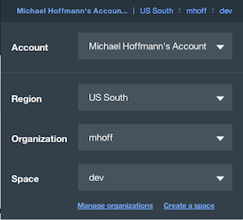
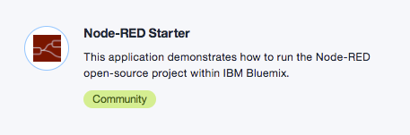
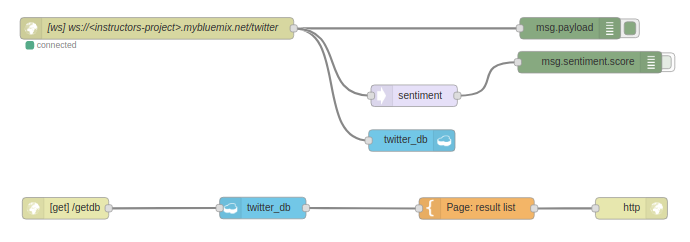
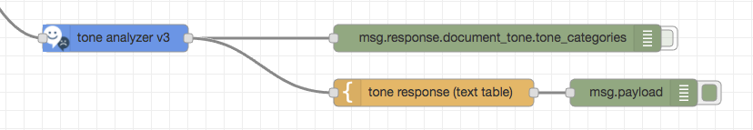
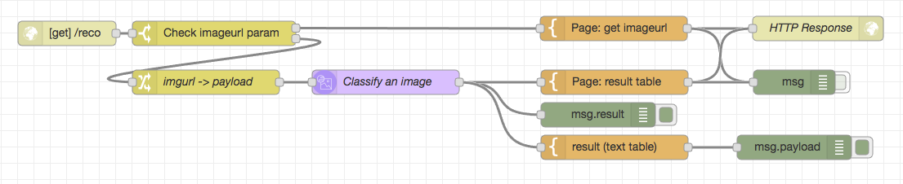

# Node-RED with Watson IoT Platform Workshop HandsOn

_Program the Bluemix Innovation Platform without writing code!_

_Try some Watson / Bluemix / IoT Services_


## Overview
Skill Level: Beginner

With IBM Watson IoT Platform you can set up rules and actions that trigger from your IoT device data. The following recipe uses a simulated device to set cloud analytics rules and actions for three metrics: temperature, humidity and object temperature.

## Prerequisites:         

Bluemix Account, Browser (not Internet Explorer) 

Link to Bluemix console:   [console.ng.bluemix.net](https://console.ng.bluemix.net)

**We will use Bluemix in the "US South" region  for this workshop!**

Make sure that:



## Login to Bluemix & Create IoT Platform Starter incl. Node-RED runtime 

Go to the catalog and create the "Internet of Things Platform Starter" application ( Boilerplates Section )


 
you must give it a **unique name** ( this name is also your hostname and so needs to be unique across Bluemix.)

( I use:  [**red-iotp-workshop-m** - _mybluemix.net_](https://red-iotp-workshop-m.mybluemix.net) )

When the new app's dashboard appears, you can open the section *Connections* from the menu on the left hand side and check, that there are two service instances bound to the app: an *Internet of Things Platform* service and a *Cloudant NoSQL DB* service.

## Registering the iotsensor with Watson IoT Platform

1. Before you can receive events and datapoints from a device, your must register it with the Watson IoT Platform. Open the **Internet of Things Platform** service and then open its IoT dashboard from the service's landing page.

1. In your Watson IoT Platform dashboard, select **Devices** from the menu pane, then click **Add Device** in the upper-right.
Snap1

1. Click **Create device type**. 

   Creating a device type will make it easier to find and identify the device after connecting it. Our device will identify itself as **device type** = *iotsensor_device* and **device ID** = *iotsensor*.

   Click **Create device type** again, then enter *iotsensor_device* as the **device type** name. On the next pages you may optionally define properties and metadata for the device type. Click **Next** on each page and finally finish the sequence by  clicking **Create**.
Snap3

1. Create a device definition

   You will return to the *Add Device* page, where your new device type is already pre-selected. Click **Next**, then enter *iotsensor* as the **Device ID**. Click **Next** twice.
   
   On the *Security* page provide an authentication token, or accept an automatically generated token. Providing a memorable authentication token may be useful for recalling it later, for example “MyDevice”. Click **Next**.
   
   Verify that the summary information shown is correct and then click **Add**. From the device information page, copy and save the following device information
   
       Organization ID
       Device Type
       Device ID
       Authentication method
       Authentication token

    Snap12

## Connect the iotsensor to the Watson IoT Platform

This step connects the "iotsensor" device to the registered device in your Watson IoT Platform organization. No device at hand? No problem! This time we use a simulated device. It's a web application, which can be called on any browser on your desktop or mobile phone or tablet.

1. In the Browser navigate to: http://watson-iot-sensor-simulator.mybluemix.net/

1. When prompted, enter the device information which you created in the Watson IoT Platform in the registration step before and saved it at the end.
Snap14

1. Verify that the connecting message changes to the name of your device, i.e. iotsensor. The device is now connected to Watson IoT Platform.

1. In the Watson IoT Platform's *Device* dashboard, click your device and verify that data is being received.
Snap16

## Optional step: create a board and some cards to visualize the data sent by your iotsensor device.

At this point, you can create a board and some cards from your Watson IoT Platform dashboard. Boards and cards can be used to keep track of device data, for example the temperature, humidity and object temperature data being sent by the iotsensor. To set up a new board follow these steps.
        In your Watson IoT Platform dashboard click Create New Board in the upper right.
        Give the board a name and description.
        Click Next then Create.
        Click on the board you have just created.
        Click Add New Card in the upper right. 
        Select the style of visualization, and select the iotsensor as the data source.

## Create an iotsensor_device Schema

    To be able to create rules that are triggered based on the datapoints from your device properties, you must first map these properties in a device type schema.
        In the Watson IoT Platform dashboard, select Devices from the menu pane, then select Manage Schemas.Snap17
        Click Add Schema.
        In the Add a schema editor, select the iotsensor_device device type and click Next.Snap18
        Click Add property.
        Selected the From Connected tab.Snap9
        Select the following properties:
            name
            temperature
            humidity
            objectTemp
        Click OK to save the schema.
   
## Create iotsensor rules and actions

    This step creates the rules and actions which will trigger based on data from the iotsensor.
        In the Watson IoT Platform dashboard select Rules from the menu pane then click Create Cloud Rule.Snap13
        Click Create A Rule.
        Name the rule Temp too high.
        Select the iotsensor_device device type and then click Next.Snap141
        In the rule builder, click New Condition rule block to edit it.
        Select the temperature property and enter 21 as the static value to compare to.Snap161
        Click OK to save the condition. 
        Click the New Action block.
        In the Set The Action dialog, click Add action.Snap19
         Add the email action and click OK.
## Activate the rule and send some data to test the rule
        In the Rules browser, activate the Temp too high rule.Snap23
        Open the iotsensor at http://watson-iot-sensor-simulator.mybluemix.net/ Note: If you are starting a new session, you must reconnect by using the same credentials as in step 2.
        Use the up arrow to raise the temperature to 22 degrees.Snap27
    View the dashboard alert and the email alert
        In the Watson IoT Platform dashboard select Boards from the menu pane, the select the Rule-centric Analytics card to open it.
        The rule is now included in the Rules I Manage card and alerts from this rule will appear in the Rule Alerts card.Snap28
        Select an alert instance to see the alert details, the triggering condition, the property datapoints at the time the rule was triggered, and the action that was taken. 
        Go to your email client to verify that the alert was sent as an email as expected.Snap29

Share this:

Tags analytics, IoT, IoT Platform, real-time, real-time analytics, real-time insights, rti, rules, watson iot

by EdProsser


-----------------------------------------------
# Node-RED with Watson IoT Platform Workshop HandsOn

 _Program the Bluemix Innovation Platform without writing code!_

_Try some Watson / Bluemix Services_

## Prerequisites:         

Bluemix Account, Browser (not Internet Explorer) 

Link to Bluemix console:   [console.ng.bluemix.net](https://console.ng.bluemix.net)

**We will use Bluemix in the "US South" region  for this workshop!**

Make sure that:


## Login to Bluemix & Create Node-RED  runtime

Go to the catalog and create the "Node-RED starter" application ( Boilerplates Section )


 
you must give it a **unique name** ( this name is your hostname and so needs to be unique across Bluemix.)

( I use:  [**red-workshopHH** - _mybluemix.net_](https://red-workshopHH.mybluemix.net) )


## Basic Flow with twitter &  Bluemix / Cloudant database

URL for non twitter users:  ```ws://red-workshopHH.mybluemix.net/twitter```



### What nodes have been used here?
Node | Type | Config
---- | ---- | ------
ws://red-workshopHH.mybluemix.net/twitter | websocket in | Type: **connect to**
twitter | twitter in | search **all public tweets** for **#starwars**
twitter_db | Cloudant (1. in, 2. out) | DB = connected Cloudant service (auto), 1. **Insert** to **twitter_db** and **only store msg.payload object** 2. Search by **all documents** in **twitter_db**
sentiment | sentiment
[get] /getdb | http in | method = **GET**, URL = **/getdb**
Page: result list | template | mustache, see code below
http | http response |
msg... | debug | select object to print for debug 


/getdb  template code (mustache) "page: result list" :scissors: :

```mustache
{{#payload}}
<li>{{payload}}</li>
{{/payload}}    
```
( Option if you have some time left: install dashboard via "manage palette"  -  add  and configure dashboard nodes  )


## Watson Tone-Analyzer



### What nodes have been used here?
Node | Type | Config
---- | ---- | ------
tone analyzer v3 | Watson Tone Analyzer | Service = connected Tone Analyzer service (auto)
tone response (text table) | template | mustache, see code below
msg... | debug | select object to print for debug 

template code (mustache)  :scissors: :

```mustache
{{#response.document_tone.tone_categories}}
{{category_name}}
------------------
{{#tones}}
{{tone_name}}       {{score}} 
{{/tones}}

{{/response.document_tone.tone_categories}}
```


## Watson Visual Recogintion



Copy this flow code  :scissors: : and import it to your NodeRED editor:

```json
[{"id":"a5f31d47.f2359","type":"http in","z":"8b214a3f.2dfac8","name":"","url":"/reco","method":"get","swaggerDoc":"","x":100,"y":440,"wires":[["bdb45433.38ed88"]]},{"id":"bdb45433.38ed88","type":"switch","z":"8b214a3f.2dfac8","name":"Check imageurl param","property":"payload.imageurl","propertyType":"msg","rules":[{"t":"null"},{"t":"else"}],"checkall":"false","outputs":2,"x":280,"y":440,"wires":[["a2b20031.9e3ab"],["44676e37.a2a16"]]},{"id":"a2b20031.9e3ab","type":"template","z":"8b214a3f.2dfac8","name":"Page: get imageurl","field":"payload","fieldType":"msg","format":"html","syntax":"mustache","template":"<h1>Node-RED Watson Visual Recognition</h1>\nEnter a image URL:\n<form  action=\"{{req._parsedUrl.pathname}}\">\n    <input type=\"url\" size=\"50\" name=\"imageurl\"/>\n    <input type=\"submit\" value=\"Analyze\"/>\n</form>\n","x":769,"y":434,"wires":[["7cced6c2.ec06e8","1a4971d0.7386fe"]]},{"id":"44676e37.a2a16","type":"change","z":"8b214a3f.2dfac8","name":"imgurl -> payload","rules":[{"t":"set","p":"payload","pt":"msg","to":"payload.imageurl","tot":"msg"}],"action":"","property":"","from":"","to":"","reg":false,"x":270,"y":500,"wires":[["da8e2bc9.4e0688"]]},{"id":"7cced6c2.ec06e8","type":"http response","z":"8b214a3f.2dfac8","name":"HTTP Response","x":1019,"y":434,"wires":[]},{"id":"1a4971d0.7386fe","type":"debug","z":"8b214a3f.2dfac8","name":"","active":false,"console":"false","complete":"true","x":990,"y":500,"wires":[]},{"id":"da8e2bc9.4e0688","type":"visual-recognition-v3","z":"8b214a3f.2dfac8","name":"Classify an image","apikey":"","image-feature":"classifyImage","lang":"en","x":490,"y":500,"wires":[["2682797a.fe6bc6","d207ffe1.e2d17","6223d22b.1b913c"]]},{"id":"d207ffe1.e2d17","type":"template","z":"8b214a3f.2dfac8","name":"Page: result table","field":"payload","fieldType":"msg","format":"html","syntax":"mustache","template":"<h1>Node-RED Watson Visual Recognition - output</h1>\n\nAnalyzed image: {{{result.images.0.resolved_url}}}  <br/>\n\n\n<table>\n<th>Class</th><th>Score</th>\n{{#result.images.0.classifiers.0.classes}}\n<tr><td>{{class}}</td><td>{{score}}</td></tr>\n{{/result.images.0.classifiers.0.classes}}\n</table>\n\n<form  action=\"{{req._parsedUrl.pathname}}\">\n    <input type=\"submit\" value=\"Try again\"/>\n</form>\n","x":770,"y":500,"wires":[["7cced6c2.ec06e8","1a4971d0.7386fe"]]},{"id":"2682797a.fe6bc6","type":"debug","z":"8b214a3f.2dfac8","name":"","active":true,"console":"false","complete":"result","x":750,"y":540,"wires":[]},{"id":"6223d22b.1b913c","type":"template","z":"8b214a3f.2dfac8","name":"result  (text table)","field":"payload","fieldType":"msg","format":"handlebars","syntax":"mustache","template":"Analyzed image: \n{{{result.images.0.resolved_url}}}  \n\nClass              Score\n{{#result.images.0.classifiers.0.classes}}\n{{class}}               {{score}}\n{{/result.images.0.classifiers.0.classes}}\n","x":770,"y":580,"wires":[["632fb744.353dc8"]]},{"id":"632fb744.353dc8","type":"debug","z":"8b214a3f.2dfac8","name":"","active":true,"console":"false","complete":"false","x":990,"y":580,"wires":[]}]
```

Some sample images to copy url:

    https://red-mh.mybluemix.net/img?img=schnitzel.jpg
    https://red-mh.mybluemix.net/img?img=maus.jpg
    https://red-mh.mybluemix.net/img?img=tandem.jpg
    https://red-mh.mybluemix.net/img?img=tomate.jpg
    https://red-mh.mybluemix.net/img?img=auto.jpg
    https://red-mh.mybluemix.net/img?img=lha330.jpg

Option if you have some time left: 

- try to enable the addional classifier food  
- create & train your own classifier 
- try to save the reco results to the Cloudant DB 

