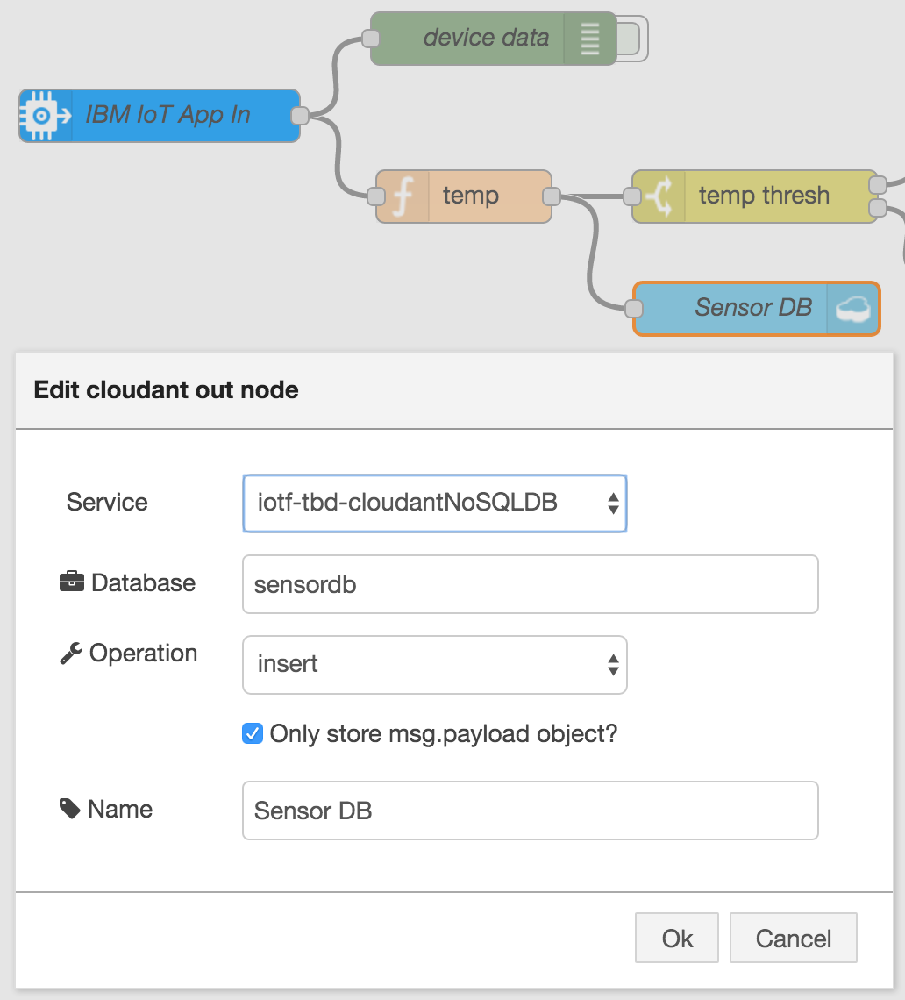

# Node-RED with Watson IoT Platform Workshop HandsOn

_Program the Bluemix Innovation Platform without writing code!_

_Try some Watson / Bluemix / IoT Services_


## Overview
Skill Level: Beginner

With IBM Watson IoT Platform you can connect IoT devices on one side (the "device side") and applications on the other side (the "application side"). That way, applications can receive and process device data and send commands back to the devices. (Of course, devices could also communicate with each other, but that's out of scope for this lab.)

This lab demonstrates how to connect a simulated device to the Watson IoT platform, vizualise its live data, and leverage the Node-RED tool for wiring together hardware devices, APIs and online services. As an example, it is described how to integrate  Bluemix services to store the data into a database and process the data with a Watson service. 

## Prerequisites:         

Bluemix Account, Browser (not Internet Explorer) 

Link to Bluemix console:   [console.ng.bluemix.net](https://console.ng.bluemix.net)

**We will use Bluemix in the "US South" region  for this workshop!**

Make sure that:


## Login to Bluemix & Create IoT Platform Starter incl. Node-RED runtime 

Go to the catalog and create the "Internet of Things Platform Starter" application ( Boilerplates Section )


 
you must give it a **unique name** ( this name is also your hostname and so needs to be unique across Bluemix.)

( I use:  [**red-iotp-workshop-m** - _mybluemix.net_](https://red-iotp-workshop-m.mybluemix.net) )

When the new app's dashboard appears, there is no reason to wait until the application is started. You can immediately open the section *Connections* from the menu on the left hand side and check, that there are two service instances bound to the app: an *Internet of Things Platform* service and a *Cloudant NoSQL DB* service.

## Registering the iotsensor with Watson IoT Platform

1. Before you can receive events and datapoints from a device, your must register it with the Watson IoT Platform. Open the **Internet of Things Platform** service and then **Launch** its IoT dashboard from the service's landing page.

1. In your Watson IoT Platform dashboard, select **Devices** from the menu pane, then click **Add Device** in the upper-right.

    


1. Create a device type definition 

    Click **Create device type**. 

    Creating a device type will make it easier to find and identify the device after connecting it. Our device will identify itself as **device type** = *iotsensor_device* and **device ID** = *iotsensor*.

    Click **Create device type** again, then enter *iotsensor_device* as the **device type** name. On the next pages you may optionally define properties and metadata for the device type. Click **Next** on each page and finally finish the sequence by  clicking **Create**.
   
    

1. Create a device definition

    You will return to the *Add Device* page, where your new device type is already pre-selected. Click **Next**, then enter *iotsensor* as the **Device ID**. Click **Next** twice.
   
    On the *Security* page either provide an authentication token, or accept an automatically generated token. Providing a memorable authentication token may be useful for recalling it later. Click **Next**.
   
    Verify that the summary information shown is correct and then click **Add**. From the device information page, copy and save the following device information
   
       Organization ID
       Device Type
       Device ID
       Authentication method
       Authentication token

    


## Connect the iotsensor to the Watson IoT Platform

This step connects the "iotsensor" device to the registered device in your Watson IoT Platform organization. No device at hand? No problem! This time we use a simulated device. It's a web application, which can be called on any browser on your desktop or mobile phone or tablet.

1. In the Browser navigate to: http://watson-iot-sensor-simulator.mybluemix.net/

1. When prompted, enter the device information which you created in the Watson IoT Platform in the registration step before and saved it at the end.

    

1. Verify that the connecting message changes to the name of your device, i.e. iotsensor. The device is now connected to the Watson IoT Platform.

1. In the Watson IoT Platform's *Device* dashboard, click your device and verify that data is being received.

    


## Open the Node-RED editor 

You've seen the data coming in from the device to the Watson IoT Platform, what next? Now you will use your device in an application created with IBM Bluemix. This application is actually a node.js app, but you will not program the logic in JavaScript. Instead you will use the Node-RED framework (on top of node.js) to define a "flow of nodes" in the Node-RED editor.

So let's revisit the application you instantiated at the very beginning of this lab...

1. If not already visible in your browser, open the application dashboard. Check, that your app has successfully started in the meantime and is running now. Select the app URL or type it into the browser to open the **Node-RED flow editor**

    ```
    https://<appname>.mybluemix.net
    ```

    After some setup steps the Node-RED editor will open.

1. You see a ready-made flow that can process temperature readings from a simulated device.

    

## Use Node-RED to read the sensor data

1. In the Node-RED workspace, double-click the **IBM IoT App In** node to open the configuration dialog.

    
    
1. In the *Authentication* field, select **Bluemix Service** from the pull-down list. The app will now authenticate to the Watson IoT Platform using the credentials contained in the binding information. 

1. Uncheck the checkbox beside *All* for the Device Type field and fill in the device type of your iotsensor device, which is *iotsensor_device*. Leave all other fields unchanged and click **Done**.

    

    <br />*Make sure that the device id is entered in lowercase, and that there are no leading or trailing space characters.*

1. Double-click the *function* node named **temp**. In the code, change *msg.payload.d.temp* to *msg.payload.d.temperature*. (Your iotsensor device will send the data with that JSON classifier.) Click **Done**

    

1. Look for the **Deploy** button in the upper right hand corner of your Node-RED workspace. The deploy button is now red; click it to deploy your flow.

    

1. Open the debug pane on the right. You will see that the flow is generating Temperature Status messages.

1. Increase the temperature value on the simulator to see the messages change in the debug pane.
 <br /> *Note that a different message appears if the temperature exceeds 40 degrees.*
 
Now that you have a basic flow of "nodes", which form an application to process the iotsensor device data, you may decide to extend the processing. There are so many options open to you, provided by the Node-RED framework and the underlying Bluemix platform with its services ... but unfortunately the time to do this lab is limited. So we just describe two of them here, but you are free to try more afterwards.   

## Store the device data into a No SQL database

1. In Node-RED flow editor, add a **Cloudant out** node

    

1. In the Service type field, select the name of Cloudant service bound to Node.js runtime from the pull-down list.
 <br />Enter a dabatase name in lowercase. Keep the default operation insert and finally give a name to the node.

    

1. Deploy the flow. Return to the Bluemix console, go to the Cloudant console and navigate into the records.

    

## Use the Watson Language Translator to translate the messages

The warning messages generated in Node-RED uses English by default. You may want to translate those messages into your oww language.

1. In the Bluemix console, create a new service **Language Translator** from the Bluemix catalog. You may bind it to your app, which would simplify the handling in Node-RED, but this time we want to demonstrate to you how to use the service like an external service. And, by the way, we will save the time here to restage the app after the binding.
 Once the service is established, open the *Service credentials* section in the service dashboard and take note of the service's credentials.

    

1. In the Node-RED flow editor, add a new **language translator** node to the flow.

1. Modify the flow accordingly to translate those messages. 

    

1. Open the **language translator** node and insert the credentials retrieved in the step before to the *username* and *password* fields. Then select the **News** *domain* and your preferred *Target* language. Click Done.

1. Deploy the updated flow.

1. Observe the translated output based on the selected language in the debug pane.


## Optional step: create a board and some cards in the Watson IoT Platform to visualize the data sent by your iotsensor device.

At this point, you can create a board and some cards from your Watson IoT Platform dashboard. Boards and cards can be used to keep track of device data, for example the temperature, humidity and object temperature data being sent by the iotsensor. 

To set up a new board follow these steps.

1. In your Watson IoT Platform dashboard click Create New Board in the upper right.
1. Give the board a name and description.
1. Click Next then Create.
1. Click on the board you have just created.
1. Click Add New Card in the upper right. 
1. Select the style of visualization, and select the iotsensor as the data source.

# Resources

This lab has been derived from several sources like other labs and receipes. See:

1. [Lab IOT - Connect your Devices with IOT Platform](https://github.com/lionelmace/bluemix-labs/tree/master/labs/Lab%20IOT%20-%20Connect%20your%20Devices%20with%20IOT%20Platform)
1. [Using Rules and Actions with IBM Watson IoT Platform Cloud Analytics](https://developer.ibm.com/recipes/tutorials/using-rules-and-actions-with-ibm-watson-iot-platform-cloud-analytics)
1. [Node-RED Workshop Hands-Out](https://github.com/cloud-dach/nodeRED-HandsOn)

Credits and many Thanks to Lionel Mace, Ed Prosser and Michael Hoffmann (all from IBM).

